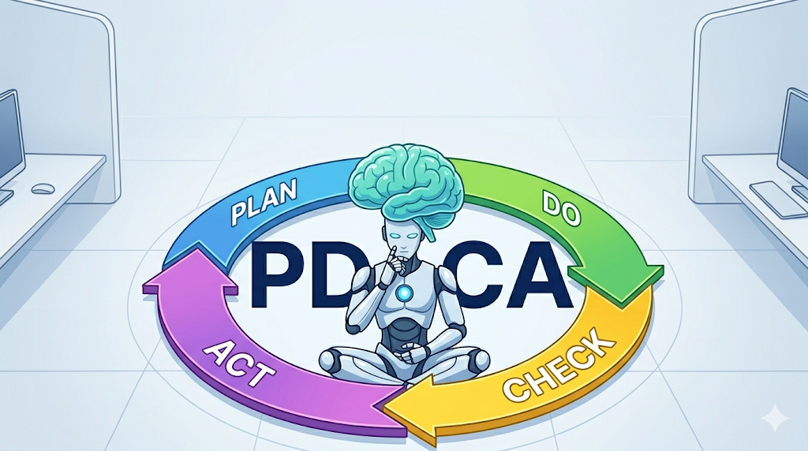
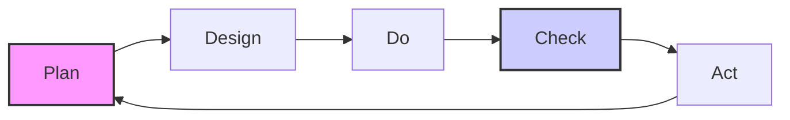

> [!abstract]
> 단순한 프롬프트 엔지니어링의 시대는 끝났습니다. 이제는 AI를 하나의 '시스템'으로 다루는 **컨텍스트 엔지니어링(Context Engineering)**과 **PDCA 방법론**의 시대입니다. bkit 프로젝트가 어떻게 AI 보조 개발의 표준을 제시하는지 소개합니다.

---

## 1. 프롬프트를 넘어 컨텍스트로: Vibecoding의 등장

최근 개발 생태계에서 **Vibecoding**이라는 단어가 자주 들립니다. AI가 코드를 대신 짜주는 시대, 개발자는 더 이상 문법과 씨름하기보다 전체적인 '흐름(Vibe)'과 '의도(Intent)'를 관리하는 데 집중하게 되었습니다.

하지만 의도만으로 복잡한 소프트웨어를 완벽하게 만들 수 있을까요? 여기서 우리는 단순한 '채팅'이 아닌, **구조화된 엔지니어링 시스템**이 필요함을 깨닫게 됩니다.

---

## 2. bkit 프로젝트: AI를 위한 전문 엔지니어링 팀

[bkit-gemini](https://github.com/popup-studio-ai/bkit-gemini)는 Gemini CLI를 단순한 챗봇에서 **시니어 엔지니어 팀**으로 변모시키는 AI 네이티브 개발 툴킷입니다. 

### bkit의 3대 핵심 레이어

1. **Domain Knowledge (35 Skills)**: SEO, API 설계, 보안 등 도메인 지식을 필요할 때만 주입하는 **점진적 노출(Progressive Disclosure)** 방식을 사용합니다.
2. **Behavioral Rules (21 Agents)**: CTO, PM, 보안 아키텍스트 등 역할이 부여된 AI 에이전트들이 협력합니다.
3. **State Management (10 Hooks)**: 개발의 생애주기를 추적하여 사용자가 말하지 않아도 현재 어떤 단계인지, 무엇을 해야 하는지 AI가 스스로 판단합니다.

> [!info] **Context Engineering이란?**
> LLM이 최적의 추론을 할 수 있도록 프롬프트뿐만 아니라 도구, 파일, 상태값 등 모든 '컨텍스트'를 체계적으로 큐레이션하는 기술입니다.

---

## 3. PDCA: AI 개발에 '규율'을 부여하는 엔진

bkit의 심장은 **PDCA(Plan-Do-Check-Act)** 사이클입니다. AI에게 "이거 해줘"라고 말하는 대신, 구조화된 단계를 밟아 품질을 보장합니다.

### 각 단계의 역할

- **`/pdca plan`**: 만들고자 하는 기능의 로드맵과 요구사항을 정의합니다.
- **`/pdca design`**: 코드를 한 줄도 쓰기 전, 기술 사양과 UI 구조를 설계합니다. 이 단계에서 AI의 컨텍스트가 정렬됩니다.
- **`/pdca do`**: 설계에 기반하여 **Surgical Update(정밀 수정)**를 수행합니다. 불필요한 코드 생성을 방지합니다.
- **`/pdca analyze`**: 구현된 코드와 설계를 대조하여 **Gap Analysis**를 수행합니다. (일치율 90% 목표)
- **`/pdca iterate`**: 발견된 격차를 AI가 스스로 보완하며 품질을 끌어올립니다.

---

## 4. 실전 사례: 알고리즘 포스트 통폐합 프로젝트

최근 이 블로그의 **알고리즘 이론 포스트 20여 개를 문제 포스트로 통합**하는 대규모 작업을 bkit과 함께 진행했습니다.

> [!success] **작업 성과**
> - **작업 시간**: 수동 작업 시 수 시간이 걸릴 분량을 **단 10분** 만에 완료
> - **정밀도**: 20개 이상의 파일에서 중복 이론을 추출하고 문제 포스트의 '심화 이론' 섹션으로 완벽히 병합
> - **안전성**: 모든 Wikilink를 자동 업데이트하여 깨진 링크 0건 달성

이 과정에서 저는 `cto-lead` 에이전트에게 의사결정만 내렸고, 실제 복잡한 파일 편집과 링크 수정은 AI 시스템이 PDCA 사이클을 돌며 완수했습니다.

---

## 5. 결론: AI는 도구가 아니라 시스템입니다

우리가 AI를 대하는 방식은 **"명령"**에서 **"오케스트레이션"**으로 바뀌어야 합니다. bkit-gemini와 PDCA 방법론은 그 변화의 중심에 서 있습니다.

단순히 코드를 생성하는 것을 넘어, **계획하고 설계하며 검증하는 엔지니어링의 본질**을 AI와 함께 실천해 보세요. 그것이 진정한 AI 네이티브 개발의 시작입니다.

---

### 🔗 관련 링크
- [bkit-gemini GitHub Repository](https://github.com/popup-studio-ai/bkit-gemini)
- [Gemini CLI 공식 문서](https://github.com/google/gemini-cli)

─────────────────────────────────────────────────
📊 bkit Feature Usage
─────────────────────────────────────────────────
✅ Used: PDCA Methodology, Context Engineering, Mermaid Visualization
⏭️ Not Used: /pdca analyze (Next step), /simplify
💡 Recommended: 포스트 업로드 전 `/pdca analyze`로 내용 검토
